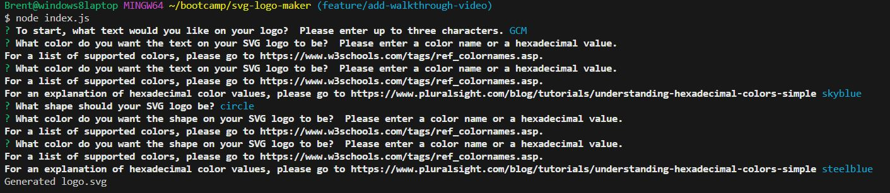
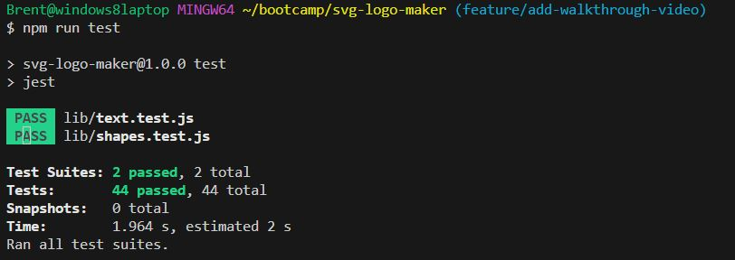

# SVG Logo Maker

## Description

This command-line program asks the user a few questions and generates an SVG logo based on his or her responses.  My motivation for building this program was to gain experience with using SVGs and SVG files in the context of JavaScript.  I built this project so that I could learn how to create SVG files with JavaScript, and also so that I could learn how to write tests for applications.  This project solves the problem of a user needing to have a logo for a project he or she is making, but also not wanting to pay a graphic designer to create the logo.  In this project, I learned how to create SVG logos with JavaScript.  I also learned the process and syntax for how to use the Jest package to write tests for a JavaScript application.

## Table of Contents (Optional)

This README isn't that long, so N/A.

## Notes to Grader

After some thought, I decided to let the SVG logo be drawn in the upper-left corner of the screen and not style it with CSS.  My reasoning behind this was that if a web designer was actually going to use the logo, he or she probably wouldn't want it to be artifically positioned in the center of the screen.

Additionally, I placed the function to generate the text portion of the SVG logo into its own file.  I did this because I needed to import the function into the text.test.js file to test it properly.  Leaving the function in index.js caused a warning to appear when running the tests, which said: "A worker process has failed to exit gracefully and has been force exited. This is likely caused by tests leaking due to improper teardown. Try running with --detectOpenHandles to find leaks. Active timers can also cause this, ensure that .unref() was called on them."  This warning appeared because, when importing the index.js file, inquirer was also imported, which caused it be run automatically.  Therefore, when running the test files, inquirer would ask the first question it would normally ask the user.  Thus. the program would have to terminate inquirer.

I added default parameters into the constructor for creating a new Triangle.  I did this because the instructions for challenge 10 gave an example test that should pass.  However, I wanted to be able to make the shapes my own size, so I made it so that if parameters weren't passed into the Triangle constructor, the size and position of the Triangle would default to the size given by the example test.

I didn't write tests for anything other than the Shape, Circle, Rectangle, and Triangle classes and the text generation method because the instructions for this challenge said it was optional to write tests for the other files in the "lib" folder that had to do with writing to the SVG file and handling user input.  Even though those parts of my program are in index.js, rather than the lib folder, it didn't make any sense to me to have to write tests for something else if it was in index.js, but not if it was in the lib folder.  In summary, because the instructions didn't ask for any tests other than the tests for the Circle, Rectangle, and Triangle classes, I didn't write tests for the methods for writing a file and handling user input that are in index.js.

## Installation

To get the development environment running for this application, first, make sure you have Node.js installed on your machine. Node.js can be downloaded here: https://nodejs.org/en. I recommend downloading the LTS version of Node.js that is on the left side of the page I just gave a link to. Next, clone the SVG Logo Maker GitHub repository with by using the "git clone" command inside of Git Bash. Then, navigate to the project folder in the command line and type "npm i inquirer@8.2.4", without the quote marks. This will install the inquirer package.  

If you would like to run the tests that I created for this application, you will also need to install the Jest package.  To do this, type "npm i jest" in Git Bash.

## Usage

Once you have followed the installation instructions, you will need to navigate to the project's directory in the command line and type node index.js. The program will execute and will ask ask the user a series of questions.  For each question, either type in an answer, or select an answer with the arrow keys from the included list of choices.  Then press **Enter**.  I will talk more about what questions the program asks in the Walkthrough Video Explanation section of this README. Please note that for the questions involving color, I have included a link to an explanation of hexadecimal color values and also a link to a list of predefined colors that the application supports. After the program has finished asking questions, it will either print an error message, indicating that something went wrong, or else it will print the message "Generated logo.svg", indicating that the SVG file was created successfully.  This file will be created in the examples folder of this project.  To open the logo in the browser, please press ALT + B.

Here is a screenshot of a successful run of the program: 

If you wish to run the tests I have created for this application, after you have installed the Jest package, run the command "npm run test".

Here is a screenshot of the tests passing successfully: 

## Walkthrough Video Explanation

To view the walkthrough video for the SVG Logo Generator, please use the following link: 
[https://drive.google.com/file/d/16WVV9y6r11G7x9MMxeYuXyK1FsjOtuyC/view](https://drive.google.com/file/d/16WVV9y6r11G7x9MMxeYuXyK1FsjOtuyC/view)

I have also included the video in this repository in the folder lib/assets/videos.

Before actually running the program, I run the command "npm run test", which runs the script "test", thereby running my tests.

The program begins by asking the user what text he or she wants on the logo.  The user can enter from one to three characters.  For this walkthrough video, I choose the word "Cat".  The program will then ask the user what color they want the text to be.   The user can choose a hex color value, or type in a predefined color.  For this walkthrough, I choose the color blue.  The program will then ask what shape the SVG logo should be.  The user can use the arrow keys to choose between circle, rectangle and triangle.  For this walkthrough, I choose a circle.  The program will then ask what color the SVG logo should be.  For this video, I choose the hex color of ff0055.  Once I receive the message "Generated logo.svg", I then click on the .svg file that just appeared in the file structure on the left and press ALT + B to open it in the browser.   I didn't open it by right-clicking and choosing Open in Default Browser because this option isn't given when right-clicking on SVG files.

## Credits

I had a tutoring session with Erik Hoversten and he showed me the syntax for writing a couple of the tests.

I also used the Xpert Learning Assistant AI chatbot to help out with writing the code.

## License

This project is under an MIT license.  Please see the licesnse in the GitHub repository for more information.

## Badges

I don't have any noteworthy badges to display.

## Features

This project generates SVG logos.  It asks the user a series of questions and then generates a logo based on their input.

## How to Contribute

This was a project I personally completed, so N/A.

## Tests

I did write tests for this application.  The shapes.test.js and text.test.js files contain these tests.  To run the tests, first, navigate to the project's folder in Git Bash.  Then, follow the installation instructions above to install the Jest package.  Next, type the command "npm run test" into Git Bash.  This runs the script named "test", which will run the tests I wrote. 
